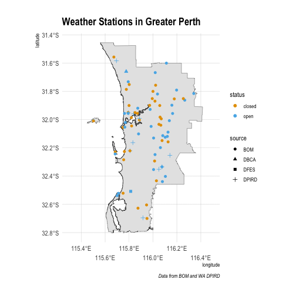
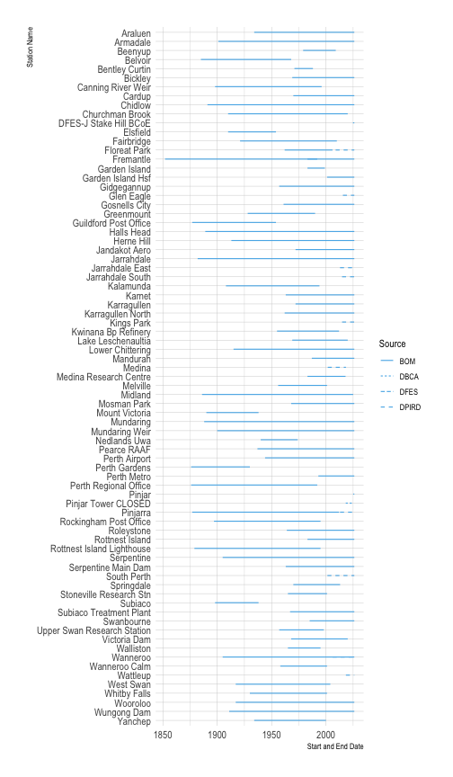

Recently the ABC had [an article](https://www.abc.net.au/news/2024-05-18/australia-s-weather-stalls-for-the-second-time-this-month/103862310) that covered the high temperatures for Perth in May from 1897 to current with a chart showing the values over time.
I thought it would be fun to use [{weatherOz}](https://docs.ropensci.org/weatherOz/) to recreate this and maybe dig a little deeper.

To start, you will need to install {weatherOz}, which currently was not on CRAN (when this was originally written) and [{hrbrthemes}](https://hrbrmstr.github.io/hrbrthemes/) from GitHub as it is ahead of the CRAN version.


``` r
if (!require("remotes"))
  install.packages("remotes")
remotes::install_github("hrbrmstr/hrbrthemes", build_vignettes = TRUE)
install.packages("weatherOz")
```

Now, the first question I had from reading the article was, "which station in Perth is this"?
As that is not clear, we will see what is available from {weatherOz} keeping in mind that we also have Western Australia's Department of Primary Industries and Regional Development's (DPIRD) weather stations available to us for later years as well and that the SILO data are *derived* from BOM.

With that in mind, let's see what stations are available for Perth.

## Finding 

This turned out to be more difficult than I expected.
{weatherOz} provides a `find_stations_in()` function[^1] that we can use with either an `sf` object or a bounding box to find stations in a geographic area of interest.

For this post, I have opted to use an `sf` object that I created by downloading ["Greater Capital City Statistical Areas - 2021 - Shapefile"](https://www.abs.gov.au/statistics/standards/australian-statistical-geography-standard-asgs-edition-3/jul2021-jun2026/access-and-downloads/digital-boundary-files/GCCSA_2021_AUST_SHP_GDA2020.zip) from the [Australian Bureau of Statistics (ABS)](https://www.abs.gov.au/statistics/standards/australian-statistical-geography-standard-asgs-edition-3/jul2021-jun2026/access-and-downloads/digital-boundary-files).


``` r
library(sf)

# set up a filepath and name for the zip file
geo_zip <- file.path(tempdir(), "GCCSA_2021_AUST_SHP_GDA2020.zip")

# download the zip file to our specified file path/file name.
download.file(
  url = "https://www.abs.gov.au/statistics/standards/australian-statistical-geography-standard-asgs-edition-3/jul2021-jun2026/access-and-downloads/digital-boundary-files/GCCSA_2021_AUST_SHP_GDA2020.zip",
  destfile = geo_zip,
  mode = "wb",
)

# construct a path to the shp file within the zip file
dsn <- sprintf(
    "/vsizip//%s/GCCSA_2021_AUST_GDA2020.shp",
    geo_zip
  )

# read the shapefile as an `sf` object directly without unzipping
abs_shp <- st_read(dsn = dsn)
```

```
## Reading layer `GCCSA_2021_AUST_GDA2020' from data source 
##   `/vsizip///var/folders/vz/txwj1tx51txgw7zv_b5c5_3m0000gn/T//RtmpKQCrMw/GCCSA_2021_AUST_SHP_GDA2020.zip/GCCSA_2021_AUST_GDA2020.shp' 
##   using driver `ESRI Shapefile'
## replacing null geometries with empty geometries
## Simple feature collection with 35 features and 10 fields (with 19 geometries empty)
## Geometry type: GEOMETRY
## Dimension:     XY
## Bounding box:  xmin: 96.81695 ymin: -43.7405 xmax: 167.998 ymax: -9.142163
## Geodetic CRS:  GDA2020
```

``` r
# inspect the new object
abs_shp
```

```
## Simple feature collection with 35 features and 10 fields (with 19 geometries empty)
## Geometry type: GEOMETRY
## Dimension:     XY
## Bounding box:  xmin: 96.81695 ymin: -43.7405 xmax: 167.998 ymax: -9.142163
## Geodetic CRS:  GDA2020
## First 10 features:
##    GCC_CODE21                             GCC_NAME21 CHG_FLAG21 CHG_LBL21
## 1       1GSYD                         Greater Sydney          0 No change
## 2       1RNSW                            Rest of NSW          0 No change
## 3       19499                 No usual address (NSW)          0 No change
## 4       19799  Migratory - Offshore - Shipping (NSW)          0 No change
## 5       2GMEL                      Greater Melbourne          0 No change
## 6       2RVIC                           Rest of Vic.          0 No change
## 7       29499                No usual address (Vic.)          0 No change
## 8       29799 Migratory - Offshore - Shipping (Vic.)          0 No change
## 9       3GBRI                       Greater Brisbane          0 No change
## 10      3RQLD                            Rest of Qld          0 No change
##    STE_CODE21      STE_NAME21 AUS_CODE21 AUS_NAME21  AREASQKM21
## 1           1 New South Wales        AUS  Australia   12368.686
## 2           1 New South Wales        AUS  Australia  788428.973
## 3           1 New South Wales        AUS  Australia          NA
## 4           1 New South Wales        AUS  Australia          NA
## 5           2        Victoria        AUS  Australia    9992.608
## 6           2        Victoria        AUS  Australia  217503.640
## 7           2        Victoria        AUS  Australia          NA
## 8           2        Victoria        AUS  Australia          NA
## 9           3      Queensland        AUS  Australia   15842.007
## 10          3      Queensland        AUS  Australia 1714329.214
##                                               LOCI_URI21
## 1  http://linked.data.gov.au/dataset/asgsed3/GCCSA/1GSYD
## 2  http://linked.data.gov.au/dataset/asgsed3/GCCSA/1RNSW
## 3  http://linked.data.gov.au/dataset/asgsed3/GCCSA/19499
## 4  http://linked.data.gov.au/dataset/asgsed3/GCCSA/19799
## 5  http://linked.data.gov.au/dataset/asgsed3/GCCSA/2GMEL
## 6  http://linked.data.gov.au/dataset/asgsed3/GCCSA/2RVIC
## 7  http://linked.data.gov.au/dataset/asgsed3/GCCSA/29499
## 8  http://linked.data.gov.au/dataset/asgsed3/GCCSA/29799
## 9  http://linked.data.gov.au/dataset/asgsed3/GCCSA/3GBRI
## 10 http://linked.data.gov.au/dataset/asgsed3/GCCSA/3RQLD
##                          geometry
## 1  MULTIPOLYGON (((151.2816 -3...
## 2  MULTIPOLYGON (((159.0623 -3...
## 3              MULTIPOLYGON EMPTY
## 4              MULTIPOLYGON EMPTY
## 5  MULTIPOLYGON (((144.8883 -3...
## 6  MULTIPOLYGON (((146.2929 -3...
## 7              MULTIPOLYGON EMPTY
## 8              MULTIPOLYGON EMPTY
## 9  MULTIPOLYGON (((153.2321 -2...
## 10 MULTIPOLYGON (((142.5314 -1...
```

``` r
# subset for only Perth
greater_perth <- subset(x = abs_shp, GCC_NAME21 == "Greater Perth")
```

## Finding Weather Stations in the Greater Perth Area

With that available, let's find stations that fall within the greater Perth area as defined by the ABS.
As we need API keys to access the data from {weatherOz}, I'll use [{keyring}](https://keyring.r-lib.org/index.html) to safely handle credentials.
The query as defined here includes closed stations, since many early records may be from closed stations.


``` r
library(weatherOz)

perth_stations <- find_stations_in(x = greater_perth,
                                   api_key = keyring::key_get("DPIRD_API_KEY"),
                                   include_closed = TRUE)

# inspect the `perth_stations` object
summary(perth_stations)
```

```
##   station_code station_name           start                 end            
##  009000 : 1    Length:87          Min.   :1852-01-01   Min.   :1930-01-01  
##  009001 : 1    Class :character   1st Qu.:1910-01-01   1st Qu.:2001-01-01  
##  009003 : 1    Mode  :character   Median :1962-01-01   Median :2026-01-24  
##  009007 : 1                       Mean   :1952-09-12   Mean   :2012-06-18  
##  009009 : 1                       3rd Qu.:1986-01-01   3rd Qu.:2026-01-24  
##  009010 : 1                       Max.   :2026-01-01   Max.   :2026-01-24  
##  (Other):81                                                                
##     latitude        longitude        state               elev_m      
##  Min.   :-32.70   Min.   :115.5   Length:87          Min.   :  3.00  
##  1st Qu.:-32.22   1st Qu.:115.8   Class :character   1st Qu.: 17.75  
##  Median :-32.01   Median :116.0   Mode  :character   Median : 40.50  
##  Mean   :-32.06   Mean   :115.9                      Mean   :108.37  
##  3rd Qu.:-31.90   3rd Qu.:116.1                      3rd Qu.:207.75  
##  Max.   :-31.56   Max.   :116.3                      Max.   :384.00  
##                                                      NA's   :7       
##     source             status               wmo       
##  Length:87          Length:87          Min.   :94602  
##  Class :character   Class :character   1st Qu.:94609  
##  Mode  :character   Mode  :character   Median :94613  
##                                        Mean   :95025  
##                                        3rd Qu.:95607  
##                                        Max.   :95614  
##                                        NA's   :75
```

This query returns 87 stations, but some are listed with "`CAUTION: Do not use these observations`".
Others are from a portable station, which may not be reliable.
Let's drop these stations.


``` r
perth_stations <- subset(x = perth_stations,
                         source != "CAUTION: Do not use these observations")
perth_stations <- perth_stations[!grepl("Portable",
                                        perth_stations$station_name), ]
```

Now there are 82 stations that start on 1852-01-01 and run to current.

## Map the Stations

We can map the stations within the greater Perth area to see where they fall using {ggplot2}, who the station owner is and see if they are open or closed.
I've chosen to add a new column to use for the legend to indicate the station data source (owner) in a cleaner fashion using the abbreviation only to save space in the plot legend.
I've used the excellent [Okabe and Ito palette](https://jfly.uni-koeln.de/color/) for this colour scheme as it is colour-blind friendly and easy to see here along with Bob Rudis's excellent [{hrbrthemes}](https://github.com/hrbrmstr/hrbrthemes).
Lastly, using [{ggdark}](https://github.com/nsgrantham/ggdark) I've inverted the colour theme to use a dark background with `theme_ipsum`.


``` r
library(ggplot2)
library(hrbrthemes)

perth_stations[, source_abbr := unlist(regmatches(
  perth_stations$source,
  gregexpr("(?<=\\().*?(?=\\))", perth_stations$source, perl = TRUE)
))]

ggplot(greater_perth) +
  geom_sf() +
  geom_point(
    data = perth_stations,
    aes(
      x = longitude,
      y = latitude,
      colour = status,
      shape = source_abbr
    ),
    size = 2
  ) +
  scale_colour_manual(values = c("#E69F00", "#56B4E9")) +
  scale_x_continuous(limits = c(115.3, 116.5),
                     guide = guide_axis(n.dodge = 2)) +
  coord_sf() +
  labs(title = "Weather Stations in Greater Perth",
       caption = "Data from BOM and WA DPIRD",
       shape = "source") +
  theme_ipsum()
```



## Visualise Station Availability

To visualise the data availability for the stations' start and end dates, we will use {ggplot2} again.


``` r
ggplot(perth_stations) +
  geom_segment(
    aes(
      x = start,
      xend = end,
      y = station_name,
      yend = station_name,
      linetype = source_abbr
    ),
    colour = "#56B4E9"
  ) +
  scale_y_discrete(limits = rev) +
  labs(linetype = "Source") +
  ylab("Station Name") +
  xlab("Start and End Date") +
  theme_ipsum()
```



## Get Weather Data for Perth Stations

Using both the DPIRD and SILO APIs we can get weather from the mid-1800s to current.

### Get DPIRD Stations' Data

We will start with the DPIRD and DPIRD-hosted station data by creating a vector of `station_code` values for stations that are NOT BOM stations using `subset()` and then use `droplevels()` to drop unused factor levels from the vector.


``` r
dpird_stations <- subset(perth_stations, source_abbr != "BOM")
dpird_stations <- droplevels(dpird_stations)

dpird_station_values <- vector(mode = "list", length = nrow(dpird_stations))
names(dpird_station_values) <- dpird_stations$station_name
```

There can be some hiccups when querying station data.
It's a good idea to wrap it in a `tryCatch()` or something like `purrr::possibly()`.
I'm a fan of using `possibly()` for these sorts of issues.
It makes it easy to spot stations with errors and investigate, but more importantly, it means you can use `purrr::map()`, `lapply()` or a `for` loop and if there is an error, you get the message you have specified and the operation carries on with the rest of the stations rather than stopping.


``` r
library(purrr)

p_summaries <- possibly(get_dpird_summaries,
                        otherwise = "There was an issue with this station.")
```
Now we will fill the list with weather data for the stations located in Greater Perth in the DPIRD network.


``` r
for (i in seq_len(nrow(dpird_stations))) {
  dpird_station_values[[i]] <- p_summaries(
    station_code = dpird_stations$station_code[i],
    start_date = dpird_stations$start[i],
    end_date = dpird_stations$end[i],
    values = "airTemperatureMax",
    api_key = keyring::key_get("DPIRD_API_KEY")
  )
}

# inspect the new object

summary(dpird_station_values)
```

```
##                        Length Class  Mode     
## DFES-J Stake Hill BCoE 1      -none- character
## Floreat Park           1      -none- character
## Glen Eagle             1      -none- character
## Jarrahdale East        1      -none- character
## Jarrahdale South       1      -none- character
## Kings Park             1      -none- character
## Medina                 1      -none- character
## Pinjar                 1      -none- character
## Pinjar Tower CLOSED    1      -none- character
## Pinjarra               1      -none- character
## South Perth            1      -none- character
## Wanneroo               1      -none- character
## Wattleup               1      -none- character
```

Next, bind the list into a single data frame object using `data.table::rbindlist()`.


``` r
library(data.table)
```

```
## data.table 1.18.0 using 5 threads (see ?getDTthreads).  Latest news: r-datatable.com
## 
## Attaching package: 'data.table'
## 
## The following object is masked from 'package:purrr':
## 
##     transpose
```

``` r
dpird_station_values <- rbindlist(dpird_station_values)
```

```
## Error in `rbindlist()`:
## ! Item 1 of input is not a data.frame, data.table or list
```

### Get BOM Stations' Data


``` r
bom_stations <- subset(perth_stations, source_abbr == "BOM")
bom_stations <- droplevels(bom_stations)

bom_station_values <- vector(mode = "list", length = nrow(bom_stations))
names(bom_station_values) <- bom_stations$station_name
```

Following the same method as with the DPIRD station network, use `possibly()` to ensure that there are no interruptions when fetching data.


``` r
p_patched_point <- possibly(get_patched_point,
                            otherwise = "There was an issue with this station.")
```
Now we will fill the list with weather data for the stations located in Greater Perth in the BOM network.


``` r
for (i in seq_len(nrow(bom_stations))) {
  bom_station_values[[i]] <- p_patched_point(
    station_code = bom_stations$station_code[i],
    start_date = bom_stations$start[i],
    end_date = bom_stations$end[i],
    values = "max_temp",
    api_key = keyring::key_get("SILO_API_KEY")
  )
}

# inspect the new object

summary(bom_station_values)
```

```
##                             Length Class  Mode     
## Araluen                     1      -none- character
## Armadale                    1      -none- character
## Beenyup                     1      -none- character
## Belvoir                     1      -none- character
## Bentley Curtin              1      -none- character
## Bickley                     1      -none- character
## Canning River Weir          1      -none- character
## Cardup                      1      -none- character
## Chidlow                     1      -none- character
## Churchman Brook             1      -none- character
## Elsfield                    1      -none- character
## Fairbridge                  1      -none- character
## Floreat Park                1      -none- character
## Fremantle                   1      -none- character
## Fremantle                   1      -none- character
## Garden Island               1      -none- character
## Garden Island Hsf           1      -none- character
## Gidgegannup                 1      -none- character
## Gosnells City               1      -none- character
## Greenmount                  1      -none- character
## Guildford Post Office       1      -none- character
## Halls Head                  1      -none- character
## Herne Hill                  1      -none- character
## Jandakot Aero               1      -none- character
## Jarrahdale                  1      -none- character
## Kalamunda                   1      -none- character
## Karnet                      1      -none- character
## Karragullen                 1      -none- character
## Karragullen North           1      -none- character
## Kwinana Bp Refinery         1      -none- character
## Lake Leschenaultia          1      -none- character
## Lower Chittering            1      -none- character
## Mandurah                    1      -none- character
## Mandurah                    1      -none- character
## Medina Research Centre      1      -none- character
## Melville                    1      -none- character
## Midland                     1      -none- character
## Mosman Park                 1      -none- character
## Mount Victoria              1      -none- character
## Mundaring                   1      -none- character
## Mundaring Weir              1      -none- character
## Nedlands Uwa                1      -none- character
## Pearce RAAF                 1      -none- character
## Perth Airport               1      -none- character
## Perth Gardens               1      -none- character
## Perth Metro                 1      -none- character
## Perth Regional Office       1      -none- character
## Pinjarra                    1      -none- character
## Rockingham Post Office      1      -none- character
## Roleystone                  1      -none- character
## Rottnest Island             1      -none- character
## Rottnest Island Lighthouse  1      -none- character
## Serpentine                  1      -none- character
## Serpentine Main Dam         1      -none- character
## Springdale                  1      -none- character
## Stoneville Research Stn     1      -none- character
## Subiaco                     1      -none- character
## Subiaco Treatment Plant     1      -none- character
## Swanbourne                  1      -none- character
## Upper Swan Research Station 1      -none- character
## Victoria Dam                1      -none- character
## Walliston                   1      -none- character
## Wanneroo                    1      -none- character
## Wanneroo Calm               1      -none- character
## West Swan                   1      -none- character
## Whitby Falls                1      -none- character
## Wooroloo                    1      -none- character
## Wungong Dam                 1      -none- character
## Yanchep                     1      -none- character
```

Unsurprisingly there were a few issues along the way.
As there are a few stations with issues, I've chosen to use `grep()` to locate the faulty stations and drop them from the list while binding it into a single data fram object.


``` r
bom_station_values <- rbindlist(
  bom_station_values[-c(grep("There was an issue with this station.",
                          bom_station_values, perl = TRUE))])
```

## Create Data Set for Plotting

Now that we have clean sets of data we can bind the two sets of data.
{weatherOz} intentionally sets the column names to be the same, regardless of the API queried to make this easy to do.
Using `data.table::bindrows()` option, `fill = TRUE` makes this easier than dropping columns that are not shared.


``` r
perth_weather <- rbind(dpird_station_values, bom_station_values, fill = TRUE)

summary(perth_weather)
```

```
##  DFES-J Stake Hill BCoE Floreat Park        Glen Eagle       
##  Length:1               Length:1           Length:1          
##  Class :character       Class :character   Class :character  
##  Mode  :character       Mode  :character   Mode  :character  
##  Jarrahdale East    Jarrahdale South    Kings Park           Medina         
##  Length:1           Length:1           Length:1           Length:1          
##  Class :character   Class :character   Class :character   Class :character  
##  Mode  :character   Mode  :character   Mode  :character   Mode  :character  
##     Pinjar          Pinjar Tower CLOSED   Pinjarra         South Perth       
##  Length:1           Length:1            Length:1           Length:1          
##  Class :character   Class :character    Class :character   Class :character  
##  Mode  :character   Mode  :character    Mode  :character   Mode  :character  
##    Wanneroo           Wattleup        
##  Length:1           Length:1          
##  Class :character   Class :character  
##  Mode  :character   Mode  :character
```

Surprisingly, there are a few `NA` values in the data, so we will drop those.


``` r
perth_weather <- subset(x = perth_weather, !is.na(air_tmax))
```

```
## Error:
## ! object 'air_tmax' not found
```

``` r
summary(perth_weather)
```

```
##  DFES-J Stake Hill BCoE Floreat Park        Glen Eagle       
##  Length:1               Length:1           Length:1          
##  Class :character       Class :character   Class :character  
##  Mode  :character       Mode  :character   Mode  :character  
##  Jarrahdale East    Jarrahdale South    Kings Park           Medina         
##  Length:1           Length:1           Length:1           Length:1          
##  Class :character   Class :character   Class :character   Class :character  
##  Mode  :character   Mode  :character   Mode  :character   Mode  :character  
##     Pinjar          Pinjar Tower CLOSED   Pinjarra         South Perth       
##  Length:1           Length:1            Length:1           Length:1          
##  Class :character   Class :character    Class :character   Class :character  
##  Mode  :character   Mode  :character    Mode  :character   Mode  :character  
##    Wanneroo           Wattleup        
##  Length:1           Length:1          
##  Class :character   Class :character  
##  Mode  :character   Mode  :character
```

We are only interested in the month of May, so we will remove all the other months' data by selecting only May (`month = 5`).


``` r
perth_weather <- subset(x = perth_weather, month == 5)
```

```
## Error in `month == 5`:
## ! comparison (==) is possible only for atomic and list types
```

Now we need to find the highest May temperatures for each station of each year.
Using `.SD` from {data.table}, we get this.


``` r
perth_highs <- perth_weather[, .SD[which.max(air_tmax)],
                             by = c("year", "station_code")]
```

```
## Error:
## ! object 'station_code' not found
```

Next, create the annual mean.


``` r
perth_highs_mean <- perth_highs[, .(air_tmax = round(mean(air_tmax), 0)),
                                by = year]
```

```
## Error:
## ! object 'perth_highs' not found
```

## Plotting May High Temperatures

Now we have a good data set for plotting.

Using {ggplot2} we can plot the high temperature for each station in May in light grey in the background with the mean stations' maximum temperatures in the foreground.
We can use [{ggiraph}](https://davidgohel.github.io/ggiraph/) to make the plot interactive, similar to the ABC's interactive version but with the extra data and greater ability to see the data points of all the stations each year.


``` r
library(ggiraph)

p <- ggplot(perth_highs, aes(x = year, y = air_tmax)) +
  geom_line(colour = "lightgrey",
            alpha = 0.1,
            aes(group = station_code)) +
  geom_line(
    data = perth_highs_mean,
    aes(x = year, y = air_tmax),
    colour = "#E69F00",
    linewidth = 0.75
  ) +
  geom_point_interactive(
    data = perth_highs_mean,
    aes(
      x = year,
      y = air_tmax,
      tooltip = air_tmax,
      data_id = air_tmax
    ),
    colour = "#E69F00"
  ) +
  ylab("Maximum Air Temperature ˚C") +
  xlab("Year") +
  labs(title = "Greater Perth May High Temperatures",
       subtitle = "Data for 71 stations sourced from Qld SILO and WA DPIRD under CC Licences") +
  theme_ipsum()
```

```
## Error:
## ! object 'perth_highs' not found
```

``` r
girafe(ggobj = p)
```

```
## Error:
## ! object 'p' not found
```

Obviously, this data does not match ABC's exactly, it does go back farther into the 1800s, 1852, with the inclusion of Fremantle and likely has more data in the more recent years with the inclusion of the DPIRD network data.
Still, it is a fun exercise to work through getting the data, subsetting it and visualising.

[^1]: Actually this function only now exists because I wanted to write this blog post and needed to find stations in the Perth metro area.
