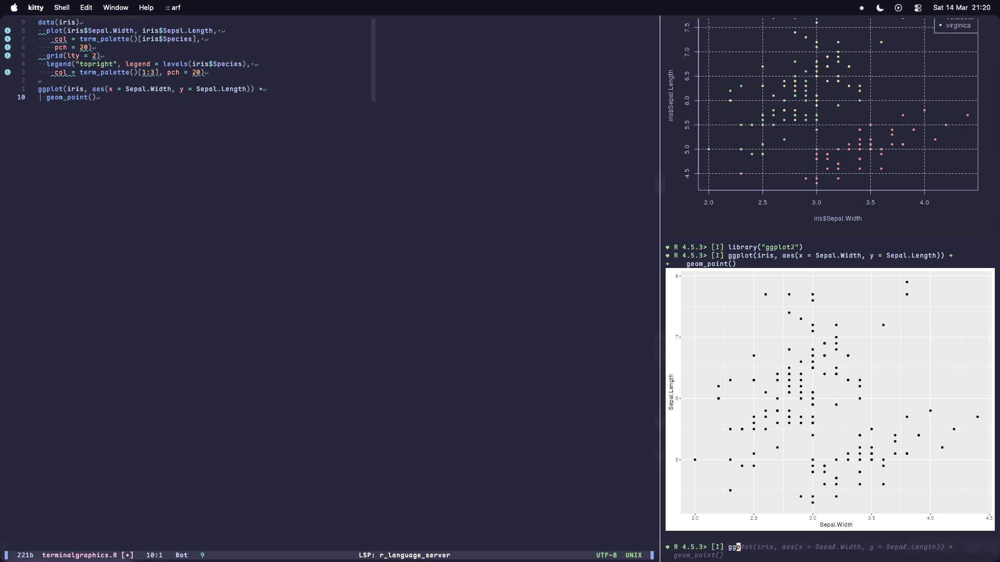

## How I Ended Up Using Neovim for R

I never really imagined I'd be a Neovim user, but here I am.

My first encounter with vi was back in the early 90s during an undergraduate computing course.
We used [elm](https://en.wikipedia.org/wiki/Elm_(email_client)) as our email client, and writing a message launched vi.
I could not make sense of it.
When I repeated the course (yes, I failed it the first time), we switched to [Pine](https://en.wikipedia.org/wiki/Pine_(email_client)), whose editor, similar to [nano](https://en.wikipedia.org/wiki/GNU_nano), felt far more intuitive.
After that, I did not think much about vi, Vim, or Neovim for many years.

That changed in 2018 at the International Congress of Plant Pathology in Boston.
I happened to sit next to [Prof. Jonathan Yuen](https://internt.slu.se/en/cv-originals/jonathan-yuen/) who opened Vim on his laptop to take notes during a committee meeting.
Something about that clicked for me.
I was already comfortable with Linux and macOS, spent plenty of time in the terminal, and the idea of a lightweight, keyboard-driven editor suddenly seemed appealing.

## A Push Toward Neovim

I had known about [R.nvim](https://github.com/R-nvim/R.nvim) for a while and had made several attempts to adopt it, but it never quite became my daily driver.

Eventually, I decided to commit.
It was just after I'd returned home from a Christmas holiday trip and work was relatively quiet with most folks still on holiday.
It was at this point that I just decided to invest the time and learn to use [Neovim](https://neovim.io/) and [R.nvim](https://github.com/R-nvim/R.nvim) properly, and I'm glad I did.

A major turning point was the release of [LazyVim](https://www.lazyvim.org/) by [folke](https://github.com/folke).
It is a Neovim distribution with a thoughtful set of defaults and preconfigured plugins, including R.nvim, that works well out of the box.
You do not need LazyVim or even the [lazy.vim plugin manager](https://lazy.folke.io/), yes LazyVim and lazy.vim are different things, to use R.nvim, but that is the setup I will be describing.

## Bringing Graphics Into the Terminal

Around this time, [djvanderlaan](https://codeberg.org/djvanderlaan) had released [{terminalgraphics}](https://codeberg.org/djvanderlaan/terminalgraphics), an R package that allows you to render graphics in the terminal using the [Kitty](https://sw.kovidgoyal.net/kitty/) graphics protocol.
I asked the R.nvim team if it were possible to use this in R.nvim, and [yes, it was](https://github.com/R-nvim/R.nvim/wiki/External-Terminals#kitty-terminal).
So now I could have graphics in my nvim session rather than relying on an X11 window or [{httpgd}](https://github.com/nx10/httpgd), which has become problematic to install with CRAN issues lately.
This was a big improvement, but I still wanted more than the stock R console that I was stuck with in R.nvim due to the configuration of Kitty splits in this extension.

 ## Alternative R Consoles and the Arrival of arf

If you have not used them before, there are several alternative R consoles besides the default one. 

The best known is [radian](https://github.com/randy3k/radian), written in Python, which offers syntax highlighting, autocompletion, and better handling of multi-line input.
These consoles feel more like a terminal-based IDE's console and are generally more pleasant to use.
The problem is that they do not always work smoothly with R.nvim, which expects the standard R console.
That is, they usually work within the Nvim terminal but not if you want to use the `external_terminal` option that R.nvim offers, where R.nvim passes flags along that some of these consoles don't accept.

Recently, [eitsupi](https://github.com/eitsupi) released [arf](https://github.com/eitsupi/arf), an alternative R front end written in Rust.
If you're not familiar, there are consoles other than the stock R console that you can use to interface with the application from the command line.
The most notable of these is [radian](https://github.com/randy3k/radian), an alternative R console written in Python.
These alternative consoles often have features that the stock R console doesn't, such as syntax highlighting, auto-completion, and better handling of multi-line code.
They act much like a terminal-based IDE console for R, and I find them to be much more pleasant to use than the stock R console.
However, the problem with these alternative consoles is that they often don't always work well with R.nvim, which is designed to work with the stock R console.

I mainly stuck to using [{httpgd}](https://github.com/nx10/httpgd) for displaying graphics and radian in my R.nvim sessions within the nvim terminal running the R console
But still, I knew that some terminal emulators like [Kitty](https://sw.kovidgoyal.net/kitty/), [Wezterm](https://wezterm.org/) and [Ghostty](https://ghostty.org/), allow you to display graphics in the terminal.
However, even when this is run within Kitty, the terminal does not report a Kitty terminal so {terminalgraphics} won't work.
Also, lately installing [{httpgd}](https://github.com/nx10/httpgd) has become problematic due to CRAN issues, so I wanted to find a way to use {terminalgraphics} within R.nvim but not lose my functionality that radian offered.
The release of arf changed this as I was able to contact eitsupi via [Mastodon](https://rstats.me/@adamhsparks/116188117087077834) and they created a [pull request in the arf GitHub repository](https://github.com/eitsupi/arf/pull/109) that fixed arf to work with standard R flags that R.nvim passes along; something that radian couldn't handle.

### Installing arf

I keep arf up to date by installing it from GitHub using cargo, the Rust package manager.

```bash
cargo install --git https://github.com/eitsupi/arf.git
```

If you aren't comfortable using cargo, there are other methods of installation, including using precompiled binaries, a shell script or Homebrew, see arf's [README](https://github.com/eitsupi/arf) for more.

## Putting it all Together

As I said above, I will assume that you are using LazyVim, but you can use R.nvim without it, and the configuration is similar.
For instructions on installing LazyVim, see the [LazyVim](https://www.lazyvim.org/installation).

You need to be using either Kitty or Wezterm as your terminal emulator to use the external terminal option in R.nvim, as these are the only currently supported terminals in R.nvim for graphics that I'm aware of if you want splits.
Ghostty is also supported for graphics but not splits, so if you want to use that terminal emulator, you would need to use the `external_term = "ghostty"` option in R.nvim and forego splits but I've not tried this to see if it works.
I have tried both Kitty and Wezterm and they both work well, but I prefer the aesthetics of Kitty, so I will be describing the setup for that terminal emulator.

### Setting up Kitty 

You will need to add some lines to your `~/.config/kitty/kitty.conf` file in order for R.nvim to be able to open a new window or a split window and communicate with the file in your nvim buffer.
Kitty uses "kittens" to launch the window split.
Kittens are small scripts that tell Kitty how to open a new window or split and what to run in it.
I've found out the hard way that kittens do not have access to my default $PATH, so I have to specify the full path to arf in the kitty.conf so that it launches in the split window.
If you don't do this, you'll end up wondering why it looks like R launches and the split closes immediately and then you try troubleshooting and radian and a basic R console work and you'll be left wondering.
So wonder no more, use this:

```
env PATH=$HOME/.cargo/bin
```

[My file](https://codeberg.org/adamhsparks/dotfiles/src/commit/fba2b45b353d0c140a357c7375b85687c40c3579/.config/kitty/kitty.conf#L9) has many more entries, but this is the most important for this to work.

Next, add these two lines to `kitty.conf` to enable the split to communicate with the parent window's buffer:

```
allow_remote_control yes
listen_on unix:/tmp/kitty-$USER.sock
```

If you're not using macOS, this may need minor changes to the `listen_on` path, you may need to drop the `-$USER` portion.:w

### Enabling R Support

Now set up R.nvim in your nvim configuration.
You can enable the extra with the `:LazyExtras` command in your nvim session.
Scroll down to the `lang.r` line and hit "x" to enable it.

Next, to enable the external terminal in R.nvim, in this case a Kitty split and arf as the console, you need to add the following to your `$HOME/.config/nvim/lua/plugins/r.nvim.lua` file:

```lua
  opts = {
  	external_term = "kitty_split",
  	R_cmd = "R",
  	R_app = "arf",
  }
```

You could also use `external_term = "wezterm_split"` if you are using Wezterm as your terminal emulator or `external_term = kitty` if you prefer a whole separate window for your R console.

At the end of your r-nvim.lua file you'll want to include this function to handle closing the split when you close nvim.

```lua
  config = function(_, opts)
    vim.api.nvim_create_autocmd("VimLeavePre", {
      callback = function()
        if vim.fn.exists(":RSend") == 2 and vim.g.R_nvim_running == 1 then
          vim.cmd("silent! RSend q()")
          vim.cmd("sleep 400m")
        end
      end,
    })
  end,
```

You might want to enable the air formatter as well, which is a Rust-based formatter for R code that works well with R.nvim and will automatically format your .R files upon saving.
To do this `Leader + c m` will open Mason, the plugin manager that comes with LazyVim, and you can search for "air" and enable it there.
Then add the following to your `$HOME/.config/nvim/lua/plugins/lspconfig.lua` (the air docs say to use `init.lua` but I follow a more LazyVim approach here) file [^1] [^2]:

```lua
local lsp = vim.lsp
lsp.config["air"] = {
	on_attach = function(_, bufnr)
		vim.api.nvim_create_autocmd("BufWritePre", {
			buffer = bufnr,
			callback = function()
				lsp.buf.format()
			end,
		})
	end,
}
```

This will then ensure that when you save, _e.g._, `:w`, that air will format your .R file.

You probably will still want to have the R-language server running for the IDE-like features that it provides, so you can enable that in the same way as air.
Add this code block to your `$HOME/.config/nvim/lua/plugins/lspconfig.lua` file to handle using both air for formatting and disable R-language server formatting to avoid conflicts [^3] [^4]:

```lua
vim.lsp.config["r_language_server"] = {
	on_attach = function(client, _)
		client.server_capabilities.documentFormattingProvider = false
		client.server_capabilities.documentRangeFormattingProvider = false
	end,
}
```

There are many more options that can be set up, I suggest looking at the R.nvim documentation, wiki and air documentation for more information on how to customize your setup, but this should be enough to get you up and running with a much more pleasant R console experience in nvim.
Some options include formatting R chunks inside Rmarkdown or Quarto files, setting up keybindings for sending code to the console, and more.


### Setting up the Graphics

Great, now we have IDE-like functionality in our R console, but we still need to set up the graphics so that we don't rely on external windows or {httpgd}.
To do this, can just install {terminalgraphics} from CRAN, `install.packages("terminalgraphics")` and after that, edit an R file in nvim, R.nvim will open a console and you can just use the package as you would any other.
Load the library, `library(terminalgraphics)`, set the terminal graphics protocol (TGP) device as the standard device:

```r
options(device = terminalgraphics::tgp)
```

Then you can create graphics that will render in the active R console.
I've opted to follow the instructions in the {terminalgraphics} README to set the default device to the terminal graphics protocol.
At the end of my .Rprofile, `~/.Rprofile`, I have this code chunk:

```r
if (interactive() && requireNamespace("terminalgraphics", quietly = TRUE) && 
      terminalgraphics::has_tgp_support()) {
  library(terminalgraphics)
  options(device = terminalgraphics::tgp, term_col = TRUE)
```

This automatically sets the terminal graphics protocol as the default device when I start an interactive R session, but only if the package is installed and the terminal supports it.

Once you've done this, you will have an IDE-like experience in your terminal with R.nvim, arf, and {terminalgraphics} so you don't have to fuss with your plots in a browser or X11 window.



## Wrap Up

This is not an exhaustive tutorial on how to set up R.nvim, but it should give you a good starting point if you want to try it out with a few utilities that I find to add value.
The [documentation for R.nvim](https://github.com/R-nvim/R.nvim/blob/main/doc/R.nvim.txt) is very complete and I suggest having a good look at it.
The [wiki](https://github.com/R-nvim/R.nvim/wiki) is a good resource for learning how to use R.nvim and its various features, including the external terminal options as well.

I learned much by looking at other people's nvim configurations, and I suggest doing that if you want to see how others have set up their R.nvim environments.
All of my dotfiles are available on Codeberg at <https://codeberg.org/adamhsparks/dotfiles>.
Specifically, you can find my [kitty.conf](https://codeberg.org/adamhsparks/dotfiles/src/branch/main/.config/kitty/kitty.conf) that also defines how to move between splits via the keyboard as the normal nvim definitions won't work, [.Rprofile](https://codeberg.org/adamhsparks/dotfiles/src/branch/main/.Rprofile) and [R.nvim.lua](https://codeberg.org/adamhsparks/dotfiles/src/branch/main/.config/nvim/lua/plugins/R-nvim.lua) files there along with many others.
This may be useful if you're unsure where files are located or how to set up your own configuration.

Check your code diagnostics if you see any red symbols in the left gutter at the top, `Leader+c d` will tell you if something is amiss.
A few times I've had it tell me to install {cyclocomp} so that everything works properly.

Happy coding!

[^1]: <https://posit-dev.github.io/air/editor-neovim.html>
[^2]: <https://codeberg.org/adamhsparks/dotfiles/src/commit/85826ec9579aec62eec2f7de5a14bc6cee55291a/.config/nvim/lua/plugins/lspconfig.lua>
[^3]: <https://posit-dev.github.io/air/editor-neovim.html#languageserver>
[^4]: <https://codeberg.org/adamhsparks/dotfiles/src/commit/85826ec9579aec62eec2f7de5a14bc6cee55291a/.config/nvim/lua/plugins/lspconfig.lua#L39>
